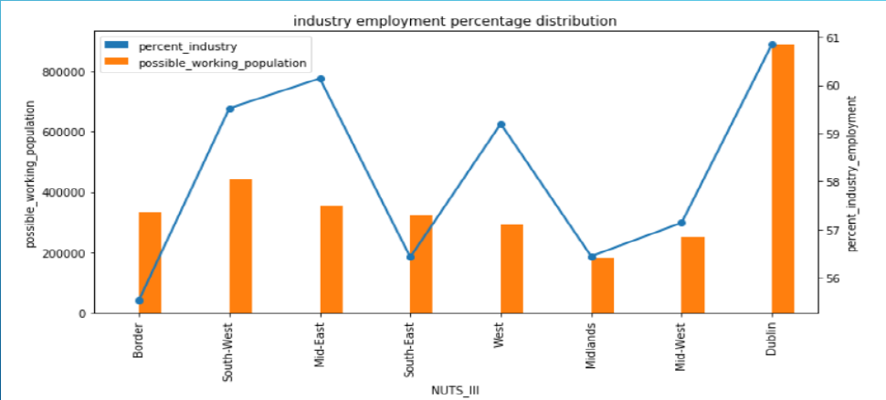
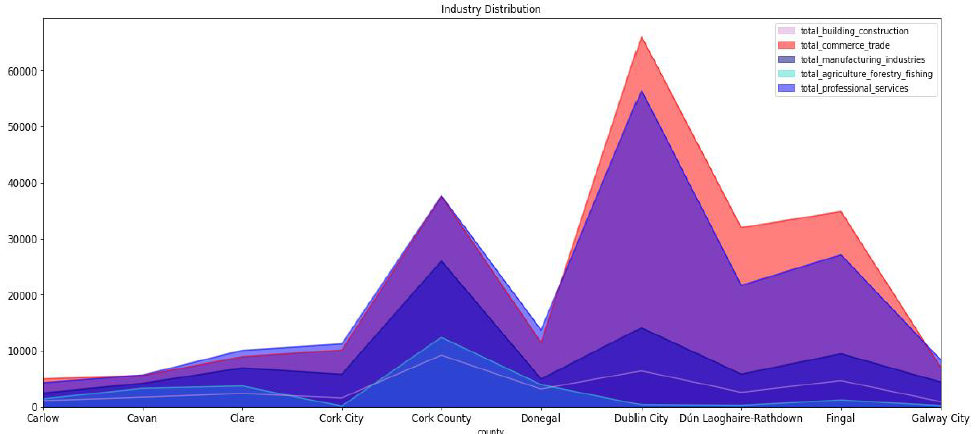
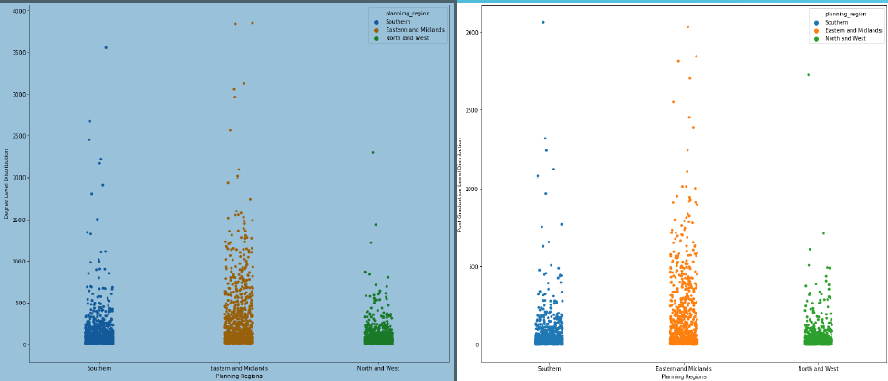
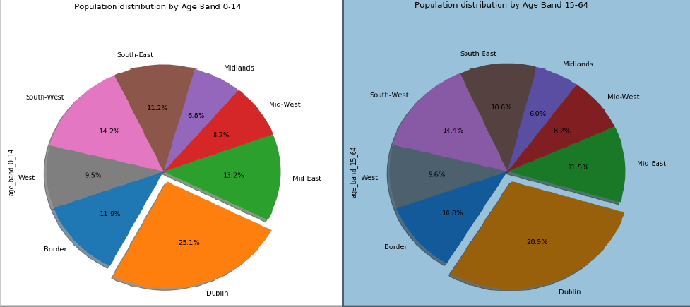
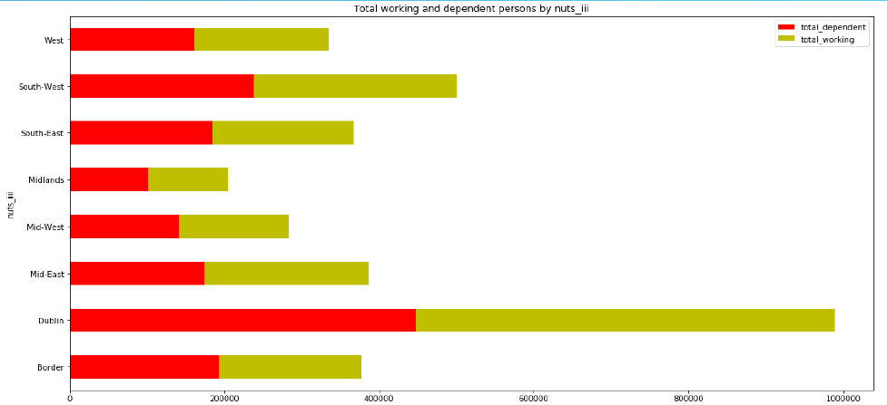
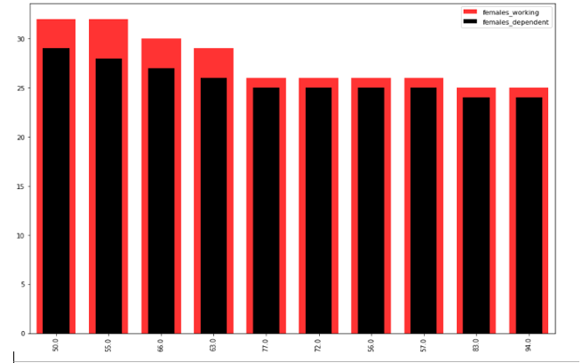

# Exploratory-Data-Analysi
This project does the exploratory Data Analysis on CSO (Central Statistics Office) data for Republic of Ireland.This project taking some important factors such as, Industrial employment numbers, education Metrics, population or census metrics and economic metrics to explore descriptive statistics and compute relationship among them. The power of visualization through Python libraries to depict relations and provide standalone counts and visualizations from mentioned metrics are performed in this repository. It covers all possible different aspects of visualization using Python. Used inbuilt libraries of python such as

1. Seaborn (Heatmap, Voilinplot)
2. matplotlib
3. geopandas
4. Plotly
5. Pandas
6. sqlalchemy

Here, data is extracted from the database. PostgresSQL Database is used where large data was stored in tabular formate. 
Python librarires "sqlalchemy" is used to made concention as SQLAlchemy considers the database to be a relational algebra engine, not just a collection of tables. Rows can be selected from not only tables but also joins and other select statements; any of these units can be composed into a larger structure. SQLAlchemy's expression language builds on this concept from its core. 

## Data visualization

#### 1. clustered Bar Line chart: Following clustered Bar Line chart displays possible working population and its industry employment percent by nuts_iii in year 2011. It is a *dual axis-graph*.

#### 2. Area graph: displays total contribution across industries for 10 counties in year 2011.

#### 3. Stripplot: shows distribution of Degree and Post Graduation level across planning regions in year 2011.

#### 4. Pie chart:  displays total population percentage nuts_iii (Nomenclature of Territorial Units for Statistics) wise in year 2011.

#### 5. Below Bar chart: displays total number of working and dependent persons nuts_iii wise in year 2011.

#### 6. Nested Histogram:

